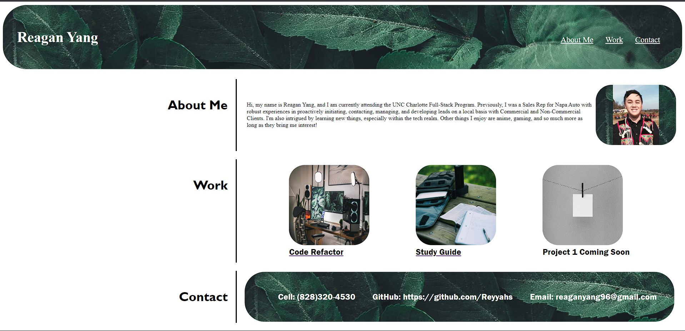

# Module 2 Challenge: Portfolio

## Description
Develope a Portfolio Webpage from scratch displaying current projects/work using what we learned in html and css.

## Task Accomplished

<ul>
    <li>Webpages shows name, photo of me, and links to all the sections</li>
    <li>UI scrools to the corresponding sections</li>
    <li>Work show projects I've done</li>
    <li>When re-sizing the webpage or view on smaller screens it adapts to viewpoint</li>
    <li>Added alt text to all images to add accessibility descriptions to images</li>
</ul>

## Website link

Link to the deploy website (https://reyyahs.github.io/glowing-garbanzo/)
## Website Preview

